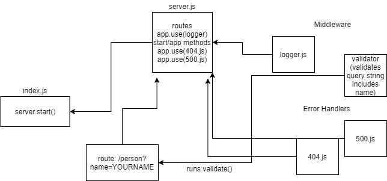

# Basic Express Server

### Author: Mark Duenas

[Test Reports](https://github.com/MarkDuenas/basic-express-server/actions)

[Deployed Link](heroku.com);


## Set up

`.env` requirements
  - `PORT` - Port Number

  ### Running the app
    - npm start
    - Endpoint: `/person?name=YOURNAMEHERE`
      - Returns JSON Object
        ```
        {
          "name":"Jack"
        }
        ```
  ### Tests
    - Server Tests: `npm run test`
  
  ### UML
  